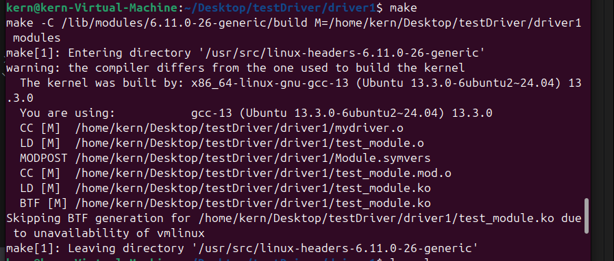
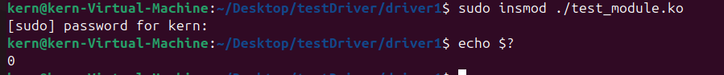
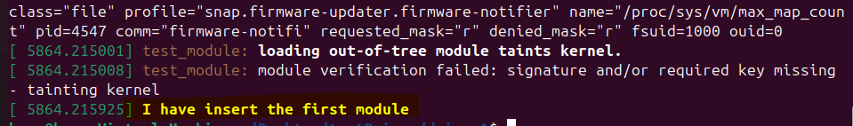
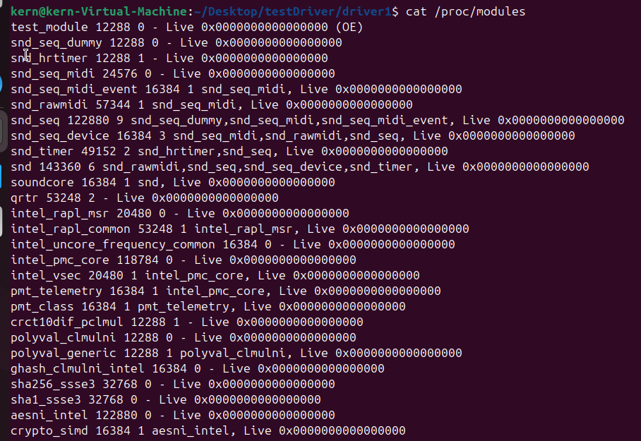

## 简介

本文及该系列的后续文章主要用于记录在学习`Linux驱动开发`过程中的相关总结或者是备忘，可能现阶段无法保证所有的理解完全正确，
后续会根据实际的学习进度来来时刻更新该系列的内容。

> 什么是Linux驱动?

Linux驱动是运行的Linux内核里面的软件模块，它负责让Linux能够识别和控制相应的硬件模块，同时让用户控件的代码可以安全，方便的访问这些硬件。

> 为什么需要驱动程序?

硬件的设备种类很多，他们的控制方式，通信协议，寄存器地址都各不相同，操作系统无法自动自动如何控制这些硬件，所以需要驱动程序来告诉操作系统，同时驱动程序也提供了一个统一的接口，让用户可以使用统一的接口操作不同的硬件设备。

```md
           系统调用
用户程序 ------------> Linux内核(->驱动程序) ---> 硬件设备

```

存在两种不同形式的Linux驱动变成方案:

* 将驱动和内核一起编译，每次修改代码需要将内核和驱动都重新编译一次
* 已内核模块的形式实现驱动，Linux可以加载或者卸载该模块，不需要编译内核

本文将讨论第二种形式。

### 创建一个内核模块

创建一个文件: `mydriver.c`,并添加以下代码:


```c
#include <linux/init.h>
#include <linux/module.h>

MODULE_LICENSE("GPL");
MODULE_AUTHOR("Kern");
MODULE_DESCRIPTION("Our first kernel module");

static int my_init(void)
{
    return 0;
}

static void my_exit(void)
{
    return;
}

module_init(my_init);
module_exit(my_exit);
```

* 通过`module_init`定义**加载module**的时候调用的函数
* 通过`module_exit`定义**卸载module**的时候调用的函数

这是最简单的一个内核模块，当前目前没有任何功能。我们先创建一个Makefile,来保证上述的模块可以正常编译

```c
TARGET_MODULE := test_module
$(TARGET_MODULE)-objs := mydriver.o
obj-m += $(TARGET_MODULE).o

all:
    make -C /lib/modules/$(shell uname -r)/build M=$(PWD) modules
clean:
    make -C /lib/modules/$(shell uname -r)/build M=$(PWD) clean
load:
    insmod ./$(TARGET_MODULE).ko
unload:
    rmmod ./$(TARGET_MODULE).ko
```

运行`make`命令，检查输出，最终我们可以看到一个`test_module.ko`文件，这即使后续我们需要加载的内核模块。


### 小试牛刀

上述代码没有任何功能，我们先对上述代码做一点优化，在模块加载以及卸载的时候，打印一些日志出来

```c
#include <linux/init.h>
#include <linux/module.h>

MODULE_LICENSE("GPL");
MODULE_AUTHOR("Kern");
MODULE_DESCRIPTION("Our first kernel module");

static int my_init(void)
{
    printk("I have insert the first module\n");
    return 0;
}

static void my_exit(void)
{
    printk("My first module has been removed");
    return;
}

module_init(my_init);
module_exit(my_exit);
```

> 注意: 这里我们增加了两个printk函数，用于打印相关的测试日志

重新运行`make`语句，生成新的`test_module.ko`文件。




* 插入模块

```sh
sudo insmod ./test_module.ko
```

运行上述命令将我们编写的第一个模块插入到内核中运行



我们通过`echo $?`检查了以下返回值，看起来模块加入没有问题。

然后我们运行`dmesg`命令，来打印`kernl ring buffer`里的内容，这里能够看到模块相关的加载信息。



观察最后一行的输出内容，这里我们在`my_init`函数里面打印出来的日志，说明内核已经成功的加载并运行了我们写实现的
模块。

运行`"cat /proc/modules"`命令，`/proc/modules`是linux系统中的一个虚拟文件，用于显示已经加载到内核中的所有模块
(.ko驱动文件)，包括他们的名字，大小，引用技术和以来关系。



试一试从里面能不能找到我们自己系的模块。
