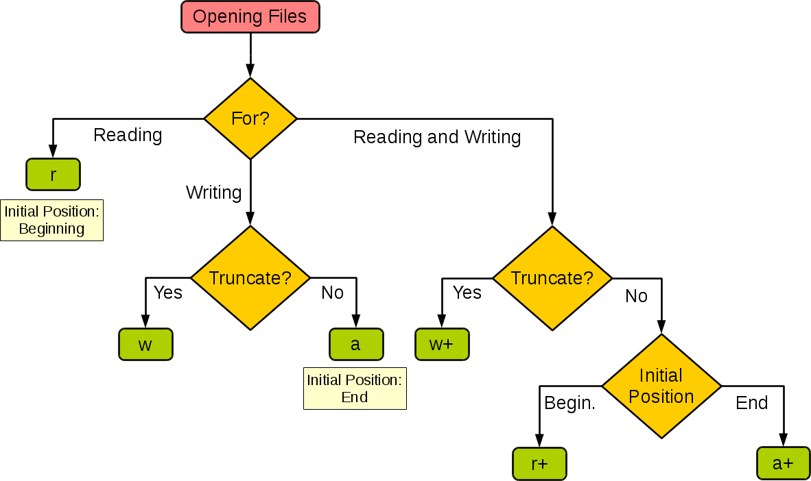

# 简介

本文主要用于介绍`python`下关于文件的相关操作。

## 文档操作指示符

> 图片来源: https://stackoverflow.com/questions/6648493/how-to-open-a-file-for-both-reading-and-writing

## 参考文档

* [w3school file handler](https://www.w3schools.com/python/python_file_handling.asp)
