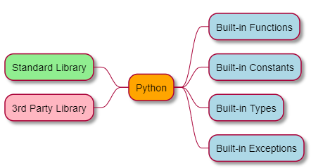

# 简介

本文主要介绍与`python`相关的工具及如何进入`python`的世界。

## 基础结构



## 安装pip

`pip`为python所使用的安装包管理工具，大部分的`第三方开发包`都是借助`pip`进行安装。

以下介绍如何在各个平台上安装`pip`:

* ubuntu
    * 安装python3的pip: `sudo apt-get install python3-pip`
    * 安装python的pip: `sudo apt-get install python-pip`
    
* pip设置代理
    * 通过指定`proxy`参数来设置代理
    * [Set proxy for pip](https://leifengblog.net/blog/how-to-use-pip-behind-a-proxy/)
   
```shell
$ pip install --proxy=http://web-proxy.us.xxxx:8080 Django
```
     
* 设置virtual environment

```sh
$ sudo apt-get install python3-venv
```

## 编写pip package

* [executable package pip install](https://dzone.com/articles/executable-package-pip-install)
* [Turn you python code into pip package](https://levelup.gitconnected.com/turn-your-python-code-into-a-pip-package-in-minutes-433ae669657f)

## Windows上同时安装python2与python3

某些情况下，需要在windows上同时安装python2与python3的版本，我的解决方法是:

1. 先安装python2与python3
2. 默认情况下python2会安装在PYTHON27的目录下
3. 通过`where python`的指令找到python的路径
4. 将python2.x版本的exe改为`python2.exe`
5. 后续如果需要使用python2,则输入python2, 使用python3直接输入python即可

## 参考手册

* [install pip on ubuntu](https://linuxize.com/post/how-to-install-pip-on-ubuntu-18.04/)
* [python3 standard Library](https://pymotw.com/3/index.html)

## 学习资源

* [PyMOTW3: Python3 standard library by example](https://pymotw.com/3/index.html)
* [Python meta programming](https://medium.com/fintechexplained/advanced-python-metaprogramming-980da1be0c7d)
* [python magic method](https://medium.com/fintechexplained/advanced-python-what-are-magic-methods-d21891cf9a08)
* [Inside python virtual machine](https://leanpub.com/insidethepythonvirtualmachine/read)
* [Magic methods in python](https://rszalski.github.io/magicmethods/)

### coroutines

* [The basic of genertors](https://realpython.com/introduction-to-python-generators/)

### Decorator

* [property decorator](https://www.tutorialsteacher.com/python/property-decorator)

### Bytes

* [bytes VS bytearray](https://www.dotnetperls.com/bytes-python)

### others

* [traitlets](https://coderzcolumn.com/tutorials/python/traitlets-eventful-classes-in-python)
