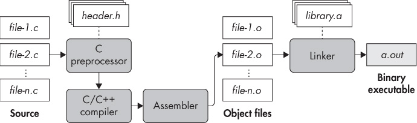

# 简介

本文主要用于介绍`C/C++`的编译流程。

`C`语言的编译流程主要分为四个部分:

* preprocessing(预处理)
* compilation(编译)
* assembly(汇编)
* linking(链接)

---



---

我们先来创建一个源文件`compilation.c`, 后续所有的操作都基于该文件来进行：

```c
#include <stdio.h>

#define FORMAT_STRING "%s"
#define MESSAGE "Hello, World\n"

int main(int argc, char *argv[])
{
   printf(FORMAT_STRING, MESSAGE);
   return 0;
}
```

## 预处理

在编写的源码里会有很多`#include`, `#define`等指示符，预处理阶段主要用于处理这些指示符。

这些`指示符`所代表的实际源码会被替换到需要编译的源文件中。

* 显示预处理后的代码

```sh
$ gcc -E -P compilation.c

typedef long unsigned int size_t;
typedef unsigned char __u_char;
typedef unsigned short int __u_short;
typedef unsigned int __u_int;
typedef unsigned long int __u_long;
typedef signed char __int8_t;
typedef unsigned char __uint8_t;
typedef signed short int __int16_t;
typedef unsigned short int __uint16_t;
...(中间内容省略)
int main(int argc, char *argv[])
{
 printf("%s", "Hello, World\n");
 return 0;
}

```
从以上的结果可以看出，我们的`头文件`以及`#define定义`都已经在预处理阶段被真正的源码替换了。

## 编译(compilation)

编译阶段做的事情就是讲预处理后的代码编译成汇编代码。当然在生成汇编代码的过程中，我们是可以指定代码优化等级的，这也就是
我们平常所说的编译时期优化。

* 显示编译后生成的汇编代码

```sh
$ gcc -masm=intel -S compilation.c
```

运行上述指令后，正常情况下会生成`compilation.s`文件，也就是我们生成的汇编代码。
其中`-masm=intel`是告诉`gcc`编译器生成`intel 语法`的汇编指令，而不是gcc默认的`AT&T`语法。

## 汇编(assembly)

汇编阶段是用于将汇编语言转换成相应的目标文件。

```sh
$ gcc -c compilation.c
```

运行上述指令后，会生成文件名`compilation.o`的目标文件，该文件并不是可执行文件，为了生成可执行文件，我们需要在
调用链接程序，来将所有的目标文件链接在一起，最后生成可执行文件。

## 链接(linking)

当所有目标文件都生成之后，最后一步就是将所有的这些`目标文件`进行链接，来生成最后的可执行文件。

```sh
$ sh compilation.c -o tes.out
```

