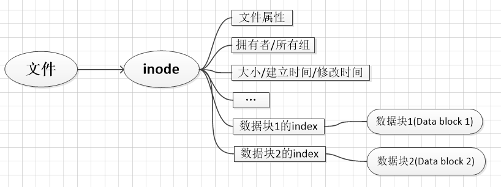
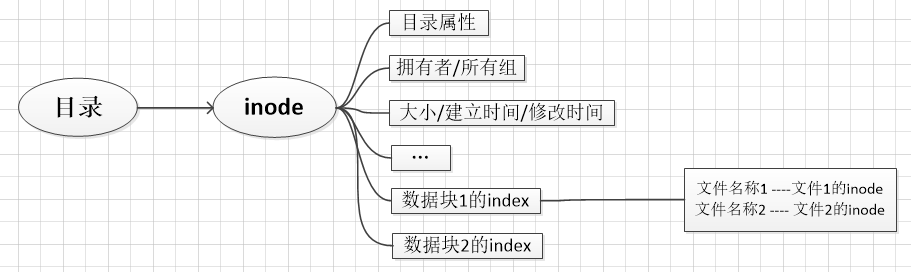

# 简介

本文主要用于描述`ext2`文件系统的相关结构及用于查看文件系统相关信息的部分指令。

## 系统结构

`ext2`文件系统主要包含三个部分:

* super block(记录文件系统整体信息,如文件系统整体信息)
* inode
* Data block

## 文件结构

文件主要有两部分构成:

* inode
* Data block

其中`inode`用于记录与文件属性相关的信息，`Data block`用于记录该文件的实际数据。在`inode`中存储用于记录数据的`Data block`的下标。



## 目录结构

`目录`在磁盘上也是以文件的形式存在的，主要包括两个部分:

* inode
* Data block

其中`inode`是用于记录与目录相关的属性，`Data block`中用于记录该目录下的`文件名称`及`与该文件相对应的inode下标`。



## 相关指令

* 查看文件的`inode`下标

```sh
$ touch inode.test #建立inode.test文件
$ ls -i inode.test
```

我本机使用`ls -i inode.test`指令输出结果为:

> 5768721 inode.test

这里的`5768721`为该文件的inode下标。
