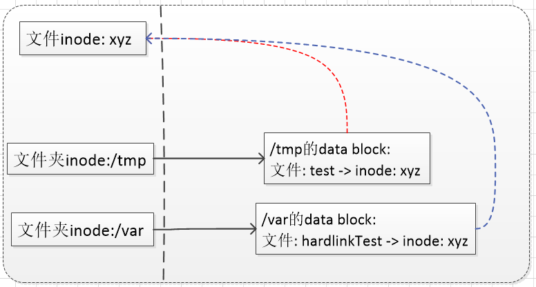

# 简介

在`linux`下存在两种文件链接形式:

* 硬链接(hard link)
* 符号链接(soft link)

如果对于ext2文件系统结构不熟悉，可以参考[ext2 文件系统结构](filesystem.md).

## 硬链接



从以上图中可以看到，在创建硬链接的时候，是通过在`文件夹`的`data block`中添加一个文件字段，
该字段的inode指向指向目标文件。

相当于有两个文件同时指向同一个`文件inode`,即使其中一个文件引用被删除，该`文件inode`依然存在，另一个文件依然可以访问该`文件inode`. 同时需要注意到当使用硬链接的时候，大部分情况下并不会增加`inode`的数量。

### 硬链接例程

```sh
# 创建test.txt
$ echo "hello world" >> test.txt
# 创建test.txt的硬链接: hardlinkTes.txt
$ ln test.txt hardlinkTest.txt
$ ls -i test.txt hardlink.txt
# 本机输出值:
4456465 hardlinkTest.txt 44564655 test.txt
```

通过以上实验可以看出:

* 两个文件指向同一个`文件inode`
* 删除其中任何一个文件，另外一个文件依然可以正常访问

## 符号链接


当创建某个文件的符号链接时:

1. 在文件夹的`data block`中添加关于符号链接文件的相关信息，这里是`softlinkTest`文件的相关信息
2. 添加`softlinkTest`文件,该文件为链接文件，文件的内容为目标文件的路径

当访问`链接文件`的时候，首先获取该链接文件内所存储的目标文件路径，然后在根据该目标文件路径去读取文件。

这里需要注意: 该`链接文件`只存储了目标文件的路径，读取文件的时候，是根据该目标文件路径去读取文件，
所以如果目标文件被删除后，再通过该链接文件去读取，就会失败，因为目标文件已经被删除。

### 符号链接例程

```sh
$ echo "hello world " >> test.txt
$ ln -s test.txt softlinkTest.txt
$ ls -i test.txt softlinkTest.txt
# 本机输出结果:
4456466 softlinkTest.txt 4456465 test.txt
$ rm test.txt
$ cat softlinkTest.txt
# 输出结果：
softlinkTest.txt : No such file or directory
```

通过以上实验可以看出:

* 两个文件的`inode`不相同
* 当`test.txt`被删除后，访问`softlinkTest.txt`会出错。
  
